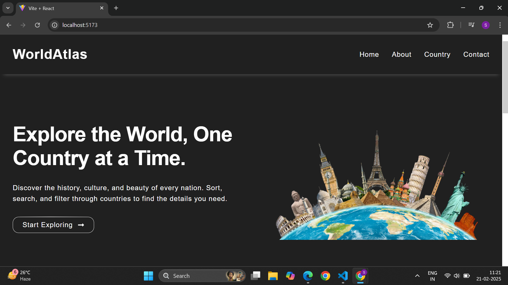
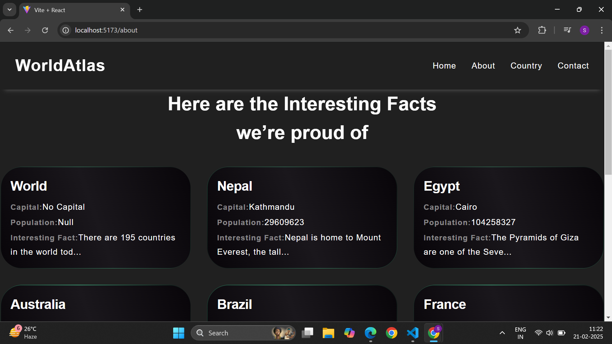
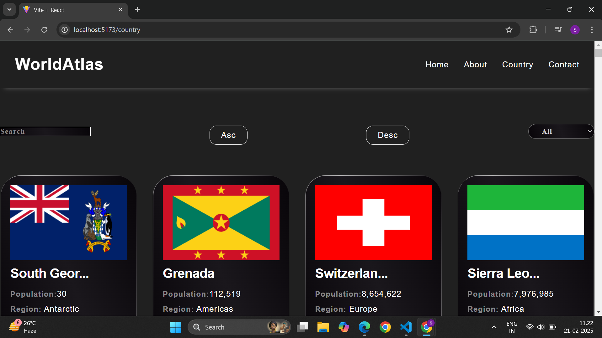
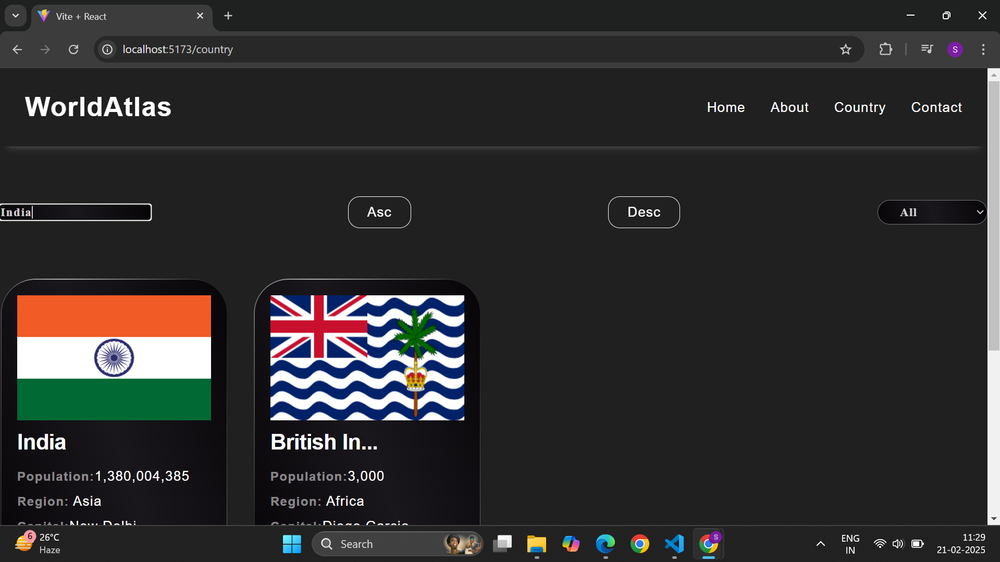
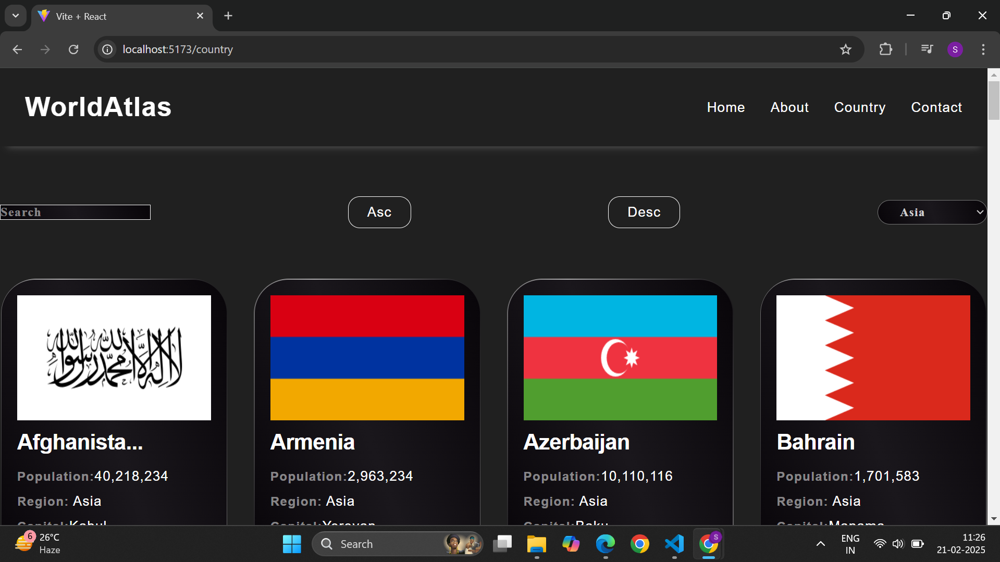
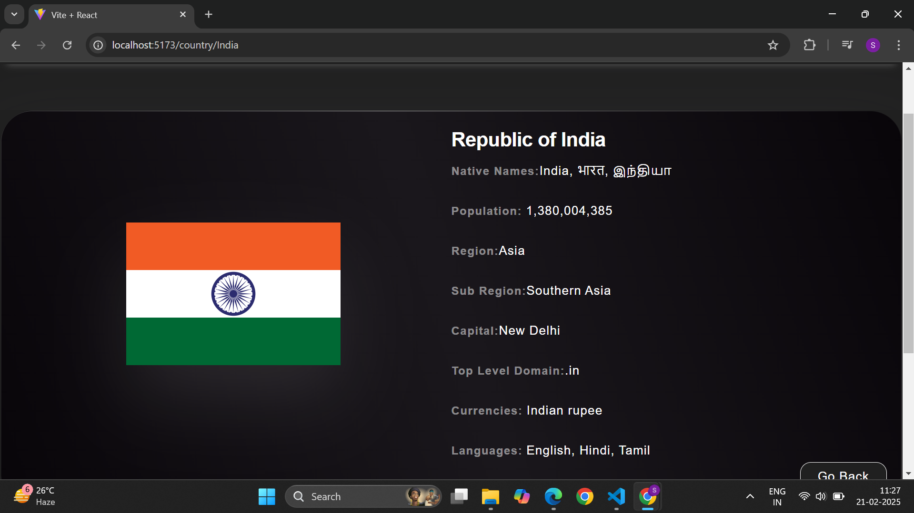
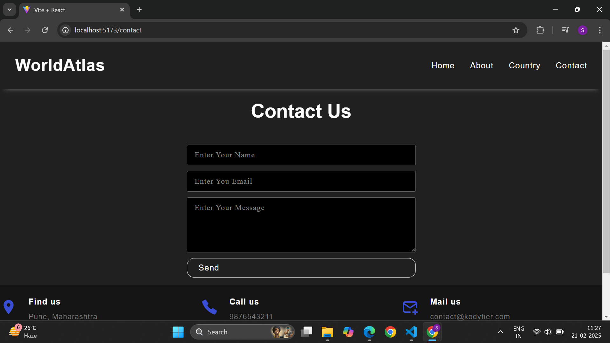

## Country-Details

Country-Details is a frontend React application that utilizes React 19 features and integrates data from a public API. This project includes functionalities such as search, sorting (ascending & descending), and dropdown filtering. 

## Tech Stack

- **client:** React, react-router-dom, axios


  ## Demo

- Home
  

## Run Localy

Clone the project

```bash
git clone [https://github.com/CODESUJON/Country_Details.git]
```

install dependency

```bash
npm install
```


go to client

```bash
npm run dev
```

## Features
- Search functionality
- Sorting (ascending & descending)
- Dropdown filtering
- API integration










